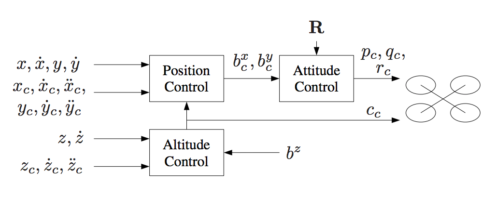

# The C++ Quadrotor Controller 
In this project, the main focus is given to tunning the cascade PID controller for a quadrotor drone trajectory. The theory behind how this controller works with different inner and outer control loops can be found in one of the research papers [Feed-Forward Parameter Identification for Precise Periodic Quadrocopter Motions](http://www.dynsyslab.org/wp-content/papercite-data/pdf/schoellig-acc12.pdf) by [Angela P. Schoellig](http://www.dynsyslab.org/prof-angela-schoellig/). The diagram mentioned below can also be found in the paper mentioned above




For easy navigation throughout this document, here is an outline:

 - [Development environment setup](#development-environment-setup)
 - [Simulator walkthrough](#simulator-walkthrough)
 - [The tasks](#the-tasks)
 - [Evaluation](#evaluation)


## Development Environment Options and their Setup ##

Regardless of your development platform, the first step is to download or clone this repository.

Once you have the code for the simulator, you will need to install the necessary compiler and IDE necessary for running the simulator.

Here are the setup and install instructions for each of the recommended IDEs for each different OS options:

### Windows ###

For Windows, the recommended IDE is Visual Studio.  Here are the steps required for getting the project up and running using Visual Studio.

1. Download and install [Visual Studio](https://www.visualstudio.com/vs/community/)
2. Select *Open Project / Solution* and open `<simulator>/project/Simulator.sln`
3. From the *Project* menu, select the *Retarget solution* option and select the Windows SDK that is installed on your computer (this should have been installed when installing Visual Studio or upon opening of the project).
4. Make sure platform matches the flavor of Windows you are using (x86 or x64). The platform is visible next to the green play button in the Visual Studio toolbar:


5. To compile and run the project / simulator, simply click on the green play button at the top of the screen.  When you run the simulator, you should see a single quadcopter, falling down.


### OS X ###

For Mac OS X, the recommended IDE is XCode, which you can get via the App Store.

1. Download and install XCode from the App Store if you don't already have it installed.
2. Open the project from the `<simulator>/project` directory.
3. After opening project, you need to set the working directory:
  1. Go to *(Project Name)* | *Edit Scheme*
  2. In new window, under *Run/Debug* on left side, under the *Options* tab, set Working Directory to `$PROJECT_DIR` and check ‘use custom working directory’.
  3. Compile and run the project. You should see a single quadcopter, falling down.


### Linux ###

For Linux, the recommended IDE is QtCreator.

1. Download and install QtCreator.
2. Open the `.pro` file from the `<simulator>/project` directory.
3. Compile and run the project (using the tab `Build` select the `qmake` option.  You should see a single quadcopter, falling down.

**NOTE:** You may need to install the GLUT libs using `sudo apt-get install freeglut3-dev`


### Advanced Versions ###

These are some more advanced setup instructions for those of you who prefer to use a different IDE or build the code manually.  Note that these instructions do assume a certain level of familiarity with the approach and are not as detailed as the instructions above.

#### CLion IDE ####

For those of you who are using the CLion IDE for developement on your platform, we have included the necessary `CMakeLists.txt` file needed to build the simulation.

#### CMake on Linux ####

For those of you interested in doing manual builds using `cmake`, we have provided a `CMakeLists.txt` file with the necessary configuration.

**NOTE: This has only been tested on Ubuntu 16.04, however, these instructions should work for most linux versions.  Also note that these instructions assume knowledge of `cmake` and the required `cmake` dependencies are installed.**

1. Create a new directory for the build files:

```sh
cd FCND-Controls-CPP
mkdir build
```

2. Navigate to the build directory and run `cmake` and then compile and build the code:

```sh
cd build
cmake ..
make
```


3. You should now be able to run the simulator with `./CPPSim` and you should see a single quadcopter, falling down.


## My choice was Linux with cmake & make with VS code as the IDE

## Simulator Walkthrough ##

Now that you have all the code on your computer and the simulator running, let's walk through some of the elements of the code and the simulator itself.

### The Code ###

For this project, the majority of the code is written in `src/QuadControl.cpp`.  This file contains all of the code for the controller that was developed in this project.

All the configuration files for the controller and the vehicle are listed in the `config` directory.  For example, for all the control gains and other desired tuning parameters, there is a specific config file called `QuadControlParams.txt` set up for you.  An import note is that while the simulator is running, you can edit this file in real time and see the affects your changes have on the quad!

The syntax of the config files is as follows:

 - `[Quad]` begins a parameter namespace.  Any variable written afterwards becomes `Quad.<variablename>` in the source code.
 - If not in a namespace, you can also write `Quad.<variablename>` directly.
 - `[Quad1 : Quad]` means that the `Quad1` namespace is created with a copy of all the variables of `Quad`.  You can then overwrite those variables by specifying new values (e.g. `Quad1.Mass` to override the copied `Quad.Mass`).  This is convenient for having default values.

You will also be using the simulator to fly some difference trajectories to test out the performance of your C++ implementation of your controller. These trajectories, along with supporting code, are found in the `traj` directory of the repo.


### The Simulator ###

In the simulator window itself, you can right click the window to select between a set of different scenarios that are designed to test the different parts of your controller.

The simulation (including visualization) is implemented in a single thread.  This is so that you can safely breakpoint code at any point and debug, without affecting any part of the simulation.

Due to deterministic timing and careful control over how the pseudo-random number generators are initialized and used, the simulation should be exactly repeatable. This means that any simulation with the same configuration should be exactly identical when run repeatedly or on different machines.

Vehicles are created and graphs are reset whenever a scenario is loaded. When a scenario is reset (due to an end condition such as time or user pressing the ‘R’ key), the config files are all re-read and state of the simulation/vehicles/graphs is reset -- however the number/name of vehicles and displayed graphs are left untouched.

When the simulation is running, you can use the arrow keys on your keyboard to impact forces on your drone to see how your controller reacts to outside forces being applied.

#### Keyboard / Mouse Controls ####

There are a handful of keyboard / mouse commands to help with the simulator itself, including applying external forces on your drone to see how your controllers reacts!

 - Left drag - rotate
 - X + left drag - pan
 - Z + left drag - zoom
 - arrow keys - apply external force
 - C - clear all graphs
 - R - reset simulation
 - Space - pause simulation


#### Notes on Parameter Tuning


1. **Parameter Ranges**: You can find the vehicle's control parameters in a file called `QuadControlParams.txt`. The default values for these parameters are all too small by a factor of somewhere between about 2X and 4X. So if a parameter has a starting value of 12, it will likely have a value somewhere between 24 and 48 once it's properly tuned.

2. **Parameter Ratios**: In this [one-page document](https://www.overleaf.com/read/bgrkghpggnyc#/61023787/) you can find a derivation of the ratio of velocity proportional gain to position proportional gain for a critically damped double integrator system. The ratio of `kpV / kpP` should be 4.


### Intro: Scenario 1

When  running the simulator for first time without any changes to the base project settings, the  quad was falling straight down.  This was due to the fact that the thrusts are simply being set to:

```txt
In the config\QuadControlParams.txt
Mass = 0.2
```

Therefore, if the mass doesn't match the actual mass of the quad, it'll fall down.  After taking few trials the `Mass` parameter was set in `config\QuadControlParams.txt` to make the vehicle more or less stay in the same spot.

Note: the scenario to be selected for this is "1_Intro" and has to be set in the file `config\LastScenario.txt` before running this test.


* Initially the simulation will look like this:
  <p align="center">
  
  </p>

  ```
  Simulation #1 (../config/1_Intro.txt)
  FAIL: ABS(Quad.PosFollowErr) was less than 0.500000 for 0.000000 seconds, which was less than 0.800000 seconds
  ```

* With the proper mass calibration that is setting it to `Mass = 0.5` in the file `config\QuadControlParams.txt`, your simulation should look a little like this:

  <p align="center">
  
  </p>

  ```
  Simulation #86 (../config/1_Intro.txt)
  PASS: ABS(Quad.PosFollowErr) was less than 0.500000 for at least 0.800000 seconds

  ```


### Body rate and roll/pitch control: Scenario 2

First, you will implement the body rate and roll / pitch control.  For the simulation, you will use `Scenario 2`.  In this scenario, you will see a quad above the origin.  It is created with a small initial rotation speed about its roll axis.  Your controller will need to stabilize the rotational motion and bring the vehicle back to level attitude.

Note: the scenario to be selected for this is "2_AttitudeControl.txt" and has to be set in the file `config\LastScenario.txt` before running this test.

Result with seed settings:
<p align="center">

</p>

```
Simulation #51 (../config/2_AttitudeControl.txt)
FAIL: ABS(Quad.Roll) was less than 0.025000 for 0.000000 seconds, which was less than 0.750000 seconds
FAIL: ABS(Quad.Omega.X) was less than 2.500000 for 0.554993 seconds, which was less than 0.750000 seconds

```
To accomplish this, you will:

1. Implement body rate control

 - implement the code in the function `GenerateMotorCommands()`
  
  <p align="center">
  
  </p>

  Where  F_1 to F_4 are the motor's thrust and taox, taoy, taoz are the moments on each direction, F_t is the total thrust, kappa denotes  the drag to thrust ratio and l value is the drone arm length over square root of two. There are a couple of things to consider; For example, on NED coordinates the z axis is inverted that is why the moment on z was inverted here. 

  Have to implement these equations of force and Moments for a quadrotor in the GenerateMotorCommands() function 


 - implement the code in the function `BodyRateControl()`

 
 ```c++
  //Calculate a desired 3-axis moment given a desired(pqrcmd) and current body rate(pqr)
  V3F momentCmd;

  ////////////////////////////// BEGIN STUDENT CODE ///////////////////////////
  V3F inertia = V3F(Ixx, Iyy, Izz);
  V3F pqrErr = pqrCmd - pqr;
  V3F pqrU_bar = kpPQR * pqrErr;
  momentCmd = inertia * pqrU_bar;
  

  /////////////////////////////// END STUDENT CODE ////////////////////////////

  return momentCmd;

 ```
 Here Ixx, Iyy, Izz(Ixx = 0.0023, Iyy = 0.0023, Izz = 0.0046) are set in the `config\QuadControlParams.txt` along with kpPQR 

 - Tune `kpPQR` in `config\QuadControlParams.txt` to get the vehicle to stop spinning quickly but not overshoot 

  ```
  # Angle rate gains used 
  kpPQR = 70, 70, 15
  
  ```

If successful, you should see the rotation of the vehicle about roll (omega.x) get controlled to 0 while other rates remain zero.  Note that the vehicle will keep flying off quite quickly, since the angle is not yet being controlled back to 0.  Also note that some overshoot will happen due to motor dynamics!.

Result:
<p align="center">
  
</p>

```
Simulation #78 (../config/2_AttitudeControl.txt)
FAIL: ABS(Quad.Roll) was less than 0.025000 for 0.000000 seconds, which was less than 0.750000 seconds
PASS: ABS(Quad.Omega.X) was less than 2.500000 for at least 0.750000 seconds

```

If you come back to this step after the next step, you can try tuning just the body rate omega (without the outside angle controller) by setting `QuadControlParams.kpBank = 0`.

2. Implement roll / pitch control
We won't be worrying about yaw just yet.

 - implement the code in the function `RollPitchControl()`

 ```c++
  // Calculate a desired pitch and roll angle rates based on a desired global
  //   lateral acceleration, the current attitude of the quad, and desired
  //   collective thrust command
  // INPUTS: 
  //   accelCmd: desired acceleration in global XY coordinates [m/s2]
  //   attitude: current or estimated attitude of the vehicle
  //   collThrustCmd: desired collective thrust of the quad [N]
  // OUTPUT:
  //   return a V3F containing the desired pitch and roll rates. The Z
  //     element of the V3F should be left at its default value (0)

  // HINTS: 
  //  - we already provide rotation matrix R: to get element R[1,2] (python) use R(1,2) (C++)
  //  - you'll need the roll/pitch gain kpBank
  //  - collThrustCmd is a force in Newtons! You'll likely want to convert it to acceleration first

  V3F pqrCmd;
  Mat3x3F R = attitude.RotationMatrix_IwrtB();

  ////////////////////////////// BEGIN STUDENT CODE ///////////////////////////
   if ( collThrustCmd > 0 ) {
    float c = - collThrustCmd / mass;
    float b_x_cmd = CONSTRAIN(accelCmd.x / c, -maxTiltAngle, maxTiltAngle);
    float b_x_err = b_x_cmd - R(0,2);
    float b_x_p_term = kpBank * b_x_err;
    
    float b_y_cmd = CONSTRAIN(accelCmd.y / c, -maxTiltAngle, maxTiltAngle);
    float b_y_err = b_y_cmd - R(1,2);
    float b_y_p_term = kpBank * b_y_err;
    
    pqrCmd.x = (R(1,0) * b_x_p_term - R(0,0) * b_y_p_term) / R(2,2);
    pqrCmd.y = (R(1,1) * b_x_p_term - R(0,1) * b_y_p_term) / R(2,2);
  } else {
    pqrCmd.x = 0.0;
    pqrCmd.y = 0.0;
  }
  
  pqrCmd.z = 0;

  /////////////////////////////// END STUDENT CODE ////////////////////////////

  return pqrCmd;

 ```

 - Tune `kpBank`(kpBank = 13.7) in `QuadControlParams.txt` to minimize settling time but avoid too much overshoot


If successful you should now see the quad level itself (as shown below), though it’ll still be flying away slowly since we’re not controlling velocity/position!  You should also see the vehicle angle (Roll) get controlled to 0.

Result:
<p align="center">

</p>

```
Simulation #71 (../config/2_AttitudeControl.txt)
PASS: ABS(Quad.Roll) was less than 0.025000 for at least 0.750000 seconds
PASS: ABS(Quad.Omega.X) was less than 2.500000 for at least 0.750000 seconds

```

### Position/velocity and yaw angle control: Scenario 3

Next, you will implement the position, altitude and yaw control for your quad.  For the simulation, you will use `Scenario 3`.  This will create 2 identical quads, one offset from its target point (but initialized with yaw = 0) and second offset from target point but yaw = 45 degrees.

Note: the scenario to be selected for this is "3_PositionControl.txt" and has to be set in the file `config\LastScenario.txt` before running this test.

Result with seed settings:
<p align="center">

</p>

```
Simulation #62 (../config/3_PositionControl.txt)
FAIL: ABS(Quad1.Pos.X) was less than 0.100000 for 0.000000 seconds, which was less than 1.250000 seconds
FAIL: ABS(Quad2.Pos.X) was less than 0.100000 for 0.000000 seconds, which was less than 1.250000 seconds
FAIL: ABS(Quad2.Yaw) was less than 0.100000 for 0.000000 seconds, which was less than 1.000000 seconds

```

 - implement the code in the function `LateralPositionControl()`
   ```c++
   // Calculate a desired horizontal acceleration based on 
  //  desired lateral position/velocity/acceleration and current pose
  // INPUTS: 
  //   posCmd: desired position, in NED [m]
  //   velCmd: desired velocity, in NED [m/s]
  //   pos: current position, NED [m]
  //   vel: current velocity, NED [m/s]
  //   accelCmdFF: feed-forward acceleration, NED [m/s2]
  // OUTPUT:
  //   return a V3F with desired horizontal accelerations. 
  //     the Z component should be 0
  // HINTS: 
  //  - use the gain parameters kpPosXY and kpVelXY
  //  - make sure you limit the maximum horizontal velocity and acceleration
  //    to maxSpeedXY and maxAccelXY

  // make sure we don't have any incoming z-component
  accelCmdFF.z = 0;
  velCmd.z = 0;
  posCmd.z = pos.z;

  // we initialize the returned desired acceleration to the feed-forward value.
  // Make sure to _add_, not simply replace, the result of your controller
  // to this variable
  V3F accelCmd = accelCmdFF;

  ////////////////////////////// BEGIN STUDENT CODE ///////////////////////////
  V3F pos_err = posCmd - pos;
  V3F pos_term = kpPosXY * pos_err;
  V3F vel_cmd = velCmd + pos_term;

  float vel_norm = vel_cmd.mag();
  if (vel_norm > maxSpeedXY) {
    vel_cmd = vel_cmd * maxSpeedXY / vel_norm;
  }
  V3F vel_err = vel_cmd - vel;
  V3F vel_term = kpVelXY * vel_err;
  V3F acc_cmd = accelCmdFF + vel_term;
  float acc_norm = acc_cmd.mag();
  if (acc_norm > maxAccelXY) {
    acc_cmd = acc_cmd * maxAccelXY / acc_norm;
  }
  accelCmd = acc_cmd;
  

  /////////////////////////////// END STUDENT CODE ////////////////////////////

  return accelCmd;

   ```

 - implement the code in the function `AltitudeControl()`
   
```c++

    // Calculate desired quad thrust based on altitude setpoint, actual altitude,
  //   vertical velocity setpoint, actual vertical velocity, and a vertical 
  //   acceleration feed-forward command
  // INPUTS: 
  //   posZCmd, velZCmd: desired vertical position and velocity in NED [m]
  //   posZ, velZ: current vertical position and velocity in NED [m]
  //   accelZCmd: feed-forward vertical acceleration in NED [m/s2]
  //   dt: the time step of the measurements [seconds]
  // OUTPUT:
  //   return a collective thrust command in [N]

  // HINTS: 
  //  - we already provide rotation matrix R: to get element R[1,2] (python) use R(1,2) (C++)
  //  - you'll need the gain parameters kpPosZ and kpVelZ
  //  - maxAscentRate and maxDescentRate are maximum vertical speeds. Note they're both >=0!
  //  - make sure to return a force, not an acceleration
  //  - remember that for an upright quad in NED, thrust should be HIGHER if the desired Z acceleration is LOWER

  Mat3x3F R = attitude.RotationMatrix_IwrtB();
  float thrust = 0;

  ////////////////////////////// BEGIN STUDENT CODE ///////////////////////////
  float z_err = posZCmd - posZ;
  float z_term = kpPosZ * z_err;

  
  float z_dot_cmd = z_term + velZCmd;
  z_dot_cmd = CONSTRAIN(z_dot_cmd, -maxAscentRate, maxDescentRate);

  float z_dot_err = z_dot_cmd - velZ;
  float z_dot_term = kpVelZ * z_dot_err;
  float z_dot_dot_cmd = z_dot_term + accelZCmd;

  thrust = -(z_dot_dot_cmd - CONST_GRAVITY) * mass / R(2,2);
  
  /////////////////////////////// END STUDENT CODE ////////////////////////////
  
  return thrust;

```

**Hint:**  For a second order system, such as the one for this quadcopter, the velocity gain (`kpVelXY` and `kpVelZ`) should be at least ~3-4 times greater than the respective position gain (`kpPosXY` and `kpPosZ`).

 - tune parameters `kpPosXY` and `kpPosZ` (# Position control gains kpPosXY = 2.8, kpPosZ = 3)


 - tune parameters `kpVelXY` and `kpVelZ` (# Velocity control gains
kpVelXY = 9, kpVelZ = 8)

If successful, the quads should be going to their destination points and tracking error should be going down (as shown below). However, one quad remains rotated in yaw.

Result:
<p align="center">

</p>

```
Simulation #40 (../config/3_PositionControl.txt)
PASS: ABS(Quad1.Pos.X) was less than 0.100000 for at least 1.250000 seconds
PASS: ABS(Quad2.Pos.X) was less than 0.100000 for at least 1.250000 seconds
FAIL: ABS(Quad2.Yaw) was less than 0.100000 for 0.000000 seconds, which was less than 1.000000 seconds

```

 - implement the code in the function `YawControl()`

 ```c++
  // Calculate a desired yaw rate to control yaw to yawCmd
  // INPUTS: 
  //   yawCmd: commanded yaw [rad]
  //   yaw: current yaw [rad]
  // OUTPUT:
  //   return a desired yaw rate [rad/s]
  // HINTS: 
  //  - use fmodf(foo,b) to unwrap a radian angle measure float foo to range [0,b]. 
  //  - use the yaw control gain parameter kpYaw

  float yawRateCmd=0;
  ////////////////////////////// BEGIN STUDENT CODE ///////////////////////////
  float yaw_cmd = fmod(yawCmd, 2.0 * F_PI);
  float psi_err = yaw_cmd - yaw;
  if (psi_err > F_PI) {
    psi_err -= 2.0 * F_PI;
  }
  else if (psi_err < -F_PI) {
    psi_err += 2.0 * F_PI;
  }
  yawRateCmd = kpYaw * psi_err;

  /////////////////////////////// END STUDENT CODE ////////////////////////////

  return yawRateCmd;

```

 - tune parameters `kpYaw` (kpYaw = 6) and the 3rd (z) component of `kpPQR` as 15 (kpPQR = 70, 70, 15)


Tune position control for settling time. Don’t try to tune yaw control too tightly, as yaw control requires a lot of control authority from a quadcopter and can really affect other degrees of freedom.  This is why you often see quadcopters with tilted motors, better yaw authority!

Result:
<p align="center">

</p>

```
Simulation #25 (../config/3_PositionControl.txt)
PASS: ABS(Quad1.Pos.X) was less than 0.100000 for at least 1.250000 seconds
PASS: ABS(Quad2.Pos.X) was less than 0.100000 for at least 1.250000 seconds
PASS: ABS(Quad2.Yaw) was less than 0.100000 for at least 1.000000 seconds

```

### Non-idealities and robustness: Scenario 4

In this part, we will explore some of the non-idealities and robustness of a controller.  For this simulation, we will use `Scenario 4`.  This is a configuration with 3 quads that are all are trying to move one meter forward.  However, this time, these quads are all a bit different:
 - The green quad has its center of mass shifted back
 - The orange vehicle is an ideal quad
 - The red vehicle is heavier than usual


1. Run your controller & parameter set from Step 3.  Do all the quads seem to be moving OK?  If not, try to tweak the controller parameters to work for all 3 (tip: relax the controller).

Note: the scenario to be selected for this is "4_Nonidealities.txt" and has to be set in the file `config\LastScenario.txt` before running this test.

Result with seed settings:
<p align="center">

</p>

```
Simulation #37 (../config/4_Nonidealities.txt)
FAIL: ABS(Quad1.PosFollowErr) was less than 0.100000 for 0.000000 seconds, which was less than 1.500000 seconds
PASS: ABS(Quad2.PosFollowErr) was less than 0.100000 for at least 1.500000 seconds
PASS: ABS(Quad3.PosFollowErr) was less than 0.100000 for at least 1.500000 seconds

```


2. Edit `AltitudeControl()` to add basic integral control to help with the different-mass vehicle.

```c++

// Calculate desired quad thrust based on altitude setpoint, actual altitude,
  //   vertical velocity setpoint, actual vertical velocity, and a vertical 
  //   acceleration feed-forward command
  // INPUTS: 
  //   posZCmd, velZCmd: desired vertical position and velocity in NED [m]
  //   posZ, velZ: current vertical position and velocity in NED [m]
  //   accelZCmd: feed-forward vertical acceleration in NED [m/s2]
  //   dt: the time step of the measurements [seconds]
  // OUTPUT:
  //   return a collective thrust command in [N]

  // HINTS: 
  //  - we already provide rotation matrix R: to get element R[1,2] (python) use R(1,2) (C++)
  //  - you'll need the gain parameters kpPosZ and kpVelZ
  //  - maxAscentRate and maxDescentRate are maximum vertical speeds. Note they're both >=0!
  //  - make sure to return a force, not an acceleration
  //  - remember that for an upright quad in NED, thrust should be HIGHER if the desired Z acceleration is LOWER

  Mat3x3F R = attitude.RotationMatrix_IwrtB();
  float thrust = 0;

  ////////////////////////////// BEGIN STUDENT CODE ///////////////////////////
  float z_err = posZCmd - posZ;
  float z_term = kpPosZ * z_err;


  // Change made here
  integratedAltitudeError += z_err * dt;
  float i_term = KiPosZ * integratedAltitudeError;

  float z_dot_cmd = z_term + velZCmd;
  z_dot_cmd = CONSTRAIN(z_dot_cmd, -maxAscentRate, maxDescentRate);

  float z_dot_err = z_dot_cmd - velZ;
  float z_dot_term = kpVelZ * z_dot_err;
  float z_dot_dot_cmd = z_dot_term + i_term +  accelZCmd;

  thrust = -(z_dot_dot_cmd - CONST_GRAVITY) * mass / R(2,2);
  
  /////////////////////////////// END STUDENT CODE ////////////////////////////
  
  return thrust;

```


3. Tune the integral control, and other control parameters until all the quads successfully move properly.  Your drones' motion should look like this:

```
# Position control gains setting in the QuadControlParams.txt
KiPosZ = 50
```


Result:
<p align="center">

</p>

```
PASS: ABS(Quad1.PosFollowErr) was less than 0.100000 for at least 1.500000 seconds
PASS: ABS(Quad2.PosFollowErr) was less than 0.100000 for at least 1.500000 seconds
PASS: ABS(Quad3.PosFollowErr) was less than 0.100000 for at least 1.500000 seconds

```

### Tracking trajectories: Scenario 5

Now that we have all the working parts of a controller, you will put it all together and test it's performance once again on a trajectory.  For this simulation, you will use `Scenario 5`.  This scenario has two quadcopters:
 - the orange one is following `traj/FigureEight.txt`
 - the other one is following `traj/FigureEightFF.txt` - for now this is the same trajectory.  For those interested in seeing how you might be able to improve the performance of your drone by adjusting how the trajectory is defined, check out **Extra Challenge 1** below!

How well is your drone able to follow the trajectory?  It is able to hold to the path fairly well?

Note: the scenario to be selected for this is "5_TrajectoryFollow.txt" and has to be set in the file `config\LastScenario.txt` before running this test.

Result:
<p align="center">

</p>

```
Simulation #8 (../config/5_TrajectoryFollow.txt)
PASS: ABS(Quad2.PosFollowErr) was less than 0.250000 for at least 3.000000 seconds

```


### Extra Challenge 1 (Optional) ###

You will notice that initially these two trajectories are the same. Let's work on improving some performance of the trajectory itself.

1. Inspect the python script `traj/MakePeriodicTrajectory.py`.  Can you figure out a way to generate a trajectory that has velocity (not just position) information?

Generating a FigureEightFF.txt with velocity info in it.

```python
with open('FigureEightFF.txt', 'w') as the_file:
	t=0
	px = 0
	py = 0
	pz = 0
	while t <= maxtime:
		x = math.sin(t * 2 * math.pi / period[0] + phase[0]) * radius * amp[0] + center[0]
		y = math.sin(t * 2 * math.pi / period[1] + phase[1]) * radius * amp[1] + center[1]
		z = math.sin(t * 2 * math.pi / period[2] + phase[2]) * radius * amp[2] + center[2]
		the_file.write(fmt(t) + "," + fmt(x) + "," + fmt(y) + "," + fmt(z))
		# vx = 0
		# vy = 0
		# vz = 0
		######## BEGIN STUDENT CODE
		
		######## END STUDENT CODE
		#the_file.write("," + fmt(vx) + "," + fmt(vy) + "," + fmt(vz));
		######## EXAMPLE SOLUTION
		the_file.write("," + fmt((x-px)/timestep) + "," + fmt((y-py)/timestep) + "," + fmt((z-pz)/timestep));
		px = x
		py = y
		pz = z
		######## END EXAMPLE SOLUTION
		
		the_file.write("\n")
		
		t += timestep

```
2. Generate a new `FigureEightFF.txt` that has velocity terms
Did the velocity-specified trajectory make a difference? Why?

The drone trajectory in yellow is better than the orange one, because of the velocity being specified along with the position, this smoothening is due to the fact that the motion at certain points on the track is slowed down so that the moment of interia of the body along a particular direction do not take the drone away. Hence velocity is regulated and drone sticks to the trajectory

With the two different trajectories, your drones' motions should look like this:

Result:
<p align="center">

</p>


### Multi-drone scenario:

Note: the scenario to be selected for this is "X_TestManyQuads.txt" and has to be set in the file `config\LastScenario.txt` before running this test.

Result:
<p align="center">

</p>


## Evaluation ##

To assist with tuning of your controller, the simulator contains real time performance evaluation.  We have defined a set of performance metrics for each of the scenarios that your controllers must meet for a successful submission.

There are two ways to view the output of the evaluation:

 - in the command line, at the end of each simulation loop, a **PASS** or a **FAIL** for each metric being evaluated in that simulation
 - on the plots, once your quad meets the metrics, you will see a green box appear on the plot notifying you of a **PASS**


### Performance Metrics ###

The specific performance metrics are as follows:

 - scenario 1 intro:
 - My Observation and result for this scenario

 ```
  Simulation #86 (../config/1_Intro.txt)
  PASS: ABS(Quad.PosFollowErr) was less than 0.500000 for at least 0.800000 seconds

 ```

 - scenario 2 required
   - roll should less than 0.025 radian of nominal for 0.75 seconds (3/4 of the duration of the loop)
   - roll rate should less than 2.5 radian/sec for 0.75 seconds
   - My Observation and result for this scenario 

   ```
   Simulation #71 (../config/2_AttitudeControl.txt)
   PASS: ABS(Quad.Roll) was less than 0.025000 for at least 0.750000 seconds
   PASS: ABS(Quad.Omega.X) was less than 2.500000 for at least 0.750000 seconds

   ```

 - scenario 3
   - X position of both drones should be within 0.1 meters of the target for at least 1.25 seconds
   - Quad2 yaw should be within 0.1 of the target for at least 1 second
   - My Observation and result for this scenario 
   
   ```
   Simulation #25 (../config/3_PositionControl.txt)
   PASS: ABS(Quad1.Pos.X) was less than 0.100000 for at least 1.250000 seconds
   PASS: ABS(Quad2.Pos.X) was less than 0.100000 for at least 1.250000 seconds
   PASS: ABS(Quad2.Yaw) was less than 0.100000 for at least 1.000000 seconds

   ```


 - scenario 4
   - position error for all 3 quads should be less than 0.1 meters for at least 1.5 seconds
   - My Observation and result for this scenario 

   ```
   PASS: ABS(Quad1.PosFollowErr) was less than 0.100000 for at least 1.500000 seconds
   PASS: ABS(Quad2.PosFollowErr) was less than 0.100000 for at least 1.500000 seconds
   PASS: ABS(Quad3.PosFollowErr) was less than 0.100000 for at least 1.500000 seconds

   ```

 - scenario 5
   - position error of the quad should be less than 0.25 meters for at least 3 seconds
   - My Observation and result for this scenario 

   ```

   Simulation #8 (../config/5_TrajectoryFollow.txt)
   PASS: ABS(Quad2.PosFollowErr) was less than 0.250000 for at least 3.000000 seconds

   ```

## Authors ##

Thanks to Fotokite for the initial development of the project code and simulator.